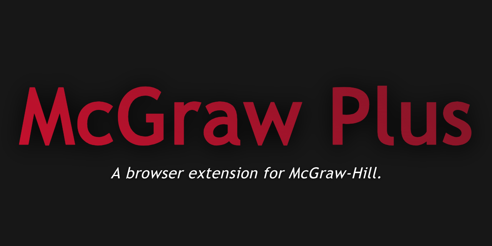

<p align="center">
  
</p>

<p align="center">
  <a href="https://github.com/KevinTrinh1227/McGraw-Plus/releases/latest">
    
  </a>
  
  
</p>

<p align="center">
  A study companion for McGraw-Hill SmartBook
</p>

---

## Features

| Category | Features |
|----------|----------|
| **Appearance** | Dark Mode, Readability Mode |
| **Productivity** | Keyboard Shortcuts (1-4, A-D), Focus Mode, Quick Copy, Tab Title Progress |
| **Organization** | Due Date Tracker, Smart Notifications, Dashboard Calendar |
| **Study** | Flashcard Generator, PDF Export, Confidence Marker |
| **Analytics** | Stats Tracker, Progress Bar, Activity Heatmap |
| **Integrations** | Discord Webhooks, AI Assistant (Groq/OpenAI/Anthropic) |

---

## Installation

1. **Download** the [latest release](https://github.com/KevinTrinh1227/McGraw-Plus/releases/latest)
2. **Extract** to a permanent location (e.g., `Documents/McGraw-Plus`)
3. **Load** in Chrome:
   - Go to `chrome://extensions`
   - Enable **Developer Mode**
   - Click **Load unpacked**
   - Select the `src/` folder
4. **Pin** the extension for easy access

---

## Browser Support

| Browser | Status |
|---------|--------|
| Chrome | ✅ Supported |
| Edge | ✅ Supported |
| Brave | ✅ Supported |
| Opera | ✅ Supported |
| Vivaldi | ✅ Supported |
| Arc | ✅ Supported |
| Firefox | ❌ Not yet |
| Safari | ❌ Not yet |

---

## Quick Start

1. Navigate to any McGraw-Hill SmartBook page
2. Click the extension icon
3. Use the power toggle to enable features
4. Press `Ctrl+Shift+M` to open the Dashboard

### Keyboard Shortcuts

| Shortcut | Action |
|----------|--------|
| `1-4` or `A-D` | Select answer |
| `Enter` | Submit |
| `Ctrl+Shift+D` | Toggle dark mode |
| `Ctrl+Shift+M` | Open Dashboard |

---

## Documentation

| Topic | Link |
|-------|------|
| Architecture | [docs/OVERVIEW.md](docs/OVERVIEW.md) |
| Data Capture | [docs/SCRAPING.md](docs/SCRAPING.md) |
| Onboarding | [docs/ONBOARDING.md](docs/ONBOARDING.md) |
| Features | [docs/FEATURES.md](docs/FEATURES.md) |
| Privacy | [docs/PRIVACY.md](docs/PRIVACY.md) |
| Security | [docs/SECURITY.md](docs/SECURITY.md) |
| Troubleshooting | [docs/TROUBLESHOOTING.md](docs/TROUBLESHOOTING.md) |
| Changelog | [CHANGELOG.md](CHANGELOG.md) |

---

## Data Capture

McGraw Plus automatically captures your account data from McGraw-Hill Connect:

| Data Type | Source |
|-----------|--------|
| User Profile | `/caas/api/user/details` |
| Courses & Sections | `/openapi/paam/studentAssignments` |
| Assignments | `/openapi/paam/studentAssignments` |
| Instructors | Section data & `/api/ccs/section/{id}/instructorInfo` |
| Textbooks | `/openapi/paam/sectionBooks/{id}` |

**Debug Mode:** Open browser console and run:
```javascript
window.__MCGRAW_PLUS_DEBUG = true  // Enable verbose logging
window.__mcgrawPlusCaptures        // View all captured data
```

See [Data Capture Guide](docs/SCRAPING.md) for full API documentation.

---

## Privacy

- All data stored locally in your browser
- No telemetry or tracking
- No external servers
- Open source for transparency

See [Privacy Policy](docs/PRIVACY.md) for details.

---

## Contributing

Contributions welcome! See [CONTRIBUTING.md](CONTRIBUTING.md) for guidelines.

---

## Disclaimer

This extension is for **educational purposes only** to enhance your study experience.

- Use responsibly and in accordance with your institution's policies
- Not affiliated with McGraw-Hill Education

---

## License

MIT License - see [LICENSE](LICENSE) for details.

---

<p align="center">
  Made by <a href="https://github.com/KevinTrinh1227">Kevin Trinh</a>
</p>
